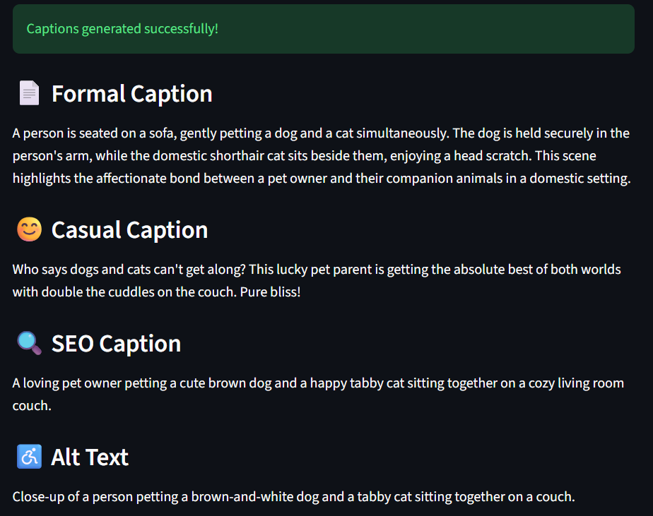

# AI_img_captions_generator
## Overview 
AI Image Caption Generator is a Streamlit-based web application that generates image captions in four distinct formats using Google's Gemini multimodal model.

### Users can upload a JPEG image and instantly receive:

Formal Caption – Professional and objective description 
Casual Caption – Friendly and conversational description 
SEO Caption – Keyword-rich caption optimized for discoverability 
Alt Text – Accessibility-focused description compliant with WCAG guidelines 

## Features
- Upload JPEG/JPG images
- AI-powered image understanding using Gemini
- Generates four caption styles simultaneously
- Simple and responsive Streamlit interface
- Environment variable support for secure API key management
- Ready for cloud deployment

## Caption Types

| Type | Description |
|------|-------------|
| Formal | Professional, objective, 2–3 sentences |
| Casual | Friendly and conversational |
| SEO | 15–25 words, keyword-rich |
| Alt Text | WCAG-compliant, under 125 characters |

## Tech Stack 
- Python
- Streamlit
- Google Gemini API
- Pillow
- Python Dotenv

## Installation
### Clone Repository
- git clone <repository-url>
- cd AI_img_captions_generator

### Create Virtual Environment
python -m venv venv

### Activate the environment:

Windows: 
venv\Scripts\activate 

Linux/Mac: 
source venv/bin/activate 

### Install Dependencies
pip install -r requirements.txt

## Configure API Key

Create a .env file in the project root: 
GEMINI_API_KEY=YOUR_API_KEY_HERE 

Do not commit this file to GitHub.

## Run Locally
streamlit run app.py

The application will start locally and open in your browser.

## Example Output

### Captions generated

## Future Improvements 
- Support PNG and WebP images
- Caption history
- Social media caption generation
- Multi-language caption support
- Download captions as text files
- Batch image processing

## License
This project is licensed under the MIT License - see the [LICENSE](LICENSE) file for details.
 

